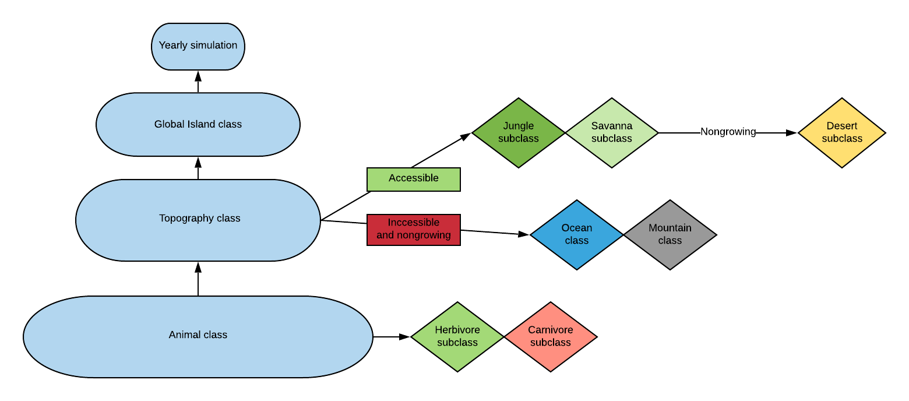
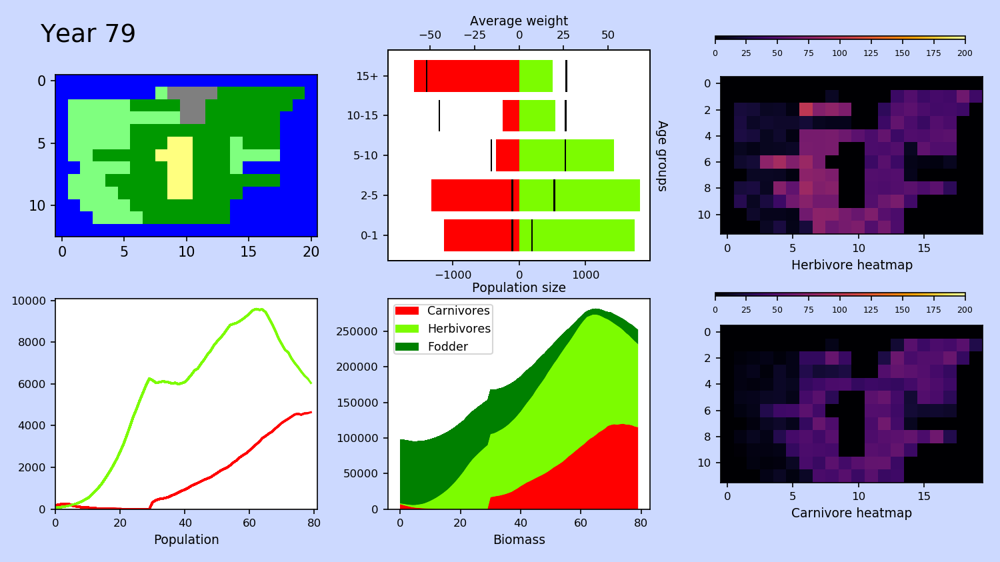

.. Biosim G05 documentation master file, created by
   sphinx-quickstart on Tue Jan 21 14:06:05 2020.
   You can adapt this file completely to your liking, but it should at least
   contain the root `toctree` directive.

Welcome to Biosim G05's documentation!
======================================

The Biosim project was developed at NMBU - The Norwegian University of Life sciences in January 2020 by Anders Karlsen and Kåre Johnsen for the Environmental Protection of Pylandia (EPAP).
The project is modelling the stability of the ecosystem on Rossumøya, a small island in Pylandia, which EPAP plans to preserve as a nature park. Rossumøya is a very special island due to its
unusually wide topographic diversity. The main topographic type at of the island is jungle, which at Rossumøya has a very high primary production. It also consist of savannas threatened by herbivore
overgrazing, inaccessible mountains and even a desert. Another unusual feature of the island is that it only hosts two animal species, one of them herbivores and one of them carnivore predators which hunt the herbivore species.

The project model
^^^^^^^^^^^^^^^^^
The model is built on the principle of object oriented programming and encapsulation:

Simulation
^^^^^^^^^^

The ecosystem stability is simulated and the results are visualized as above.

- The top left figure shows a map of Rossumøya
- The lower left figure shows the population development
- The top middle figure shows the population pyramid of the island (lower x-axis), and the mean weight for the respective weight group (higher y-axis).
- The lower middle figure visualize the Rossumøyas total biomass as a stacked plot.
- The top and lower right figures shows the heatmap for respectively the herbivore and carnivore population

.. toctree::
   :maxdepth: 2
   :caption: Contents:

   biosim.rst

Indices and tables
==================

* :ref:`genindex`
* :ref:`modindex`
* :ref:`search`
